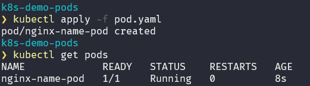
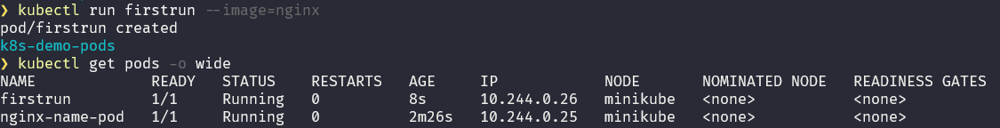
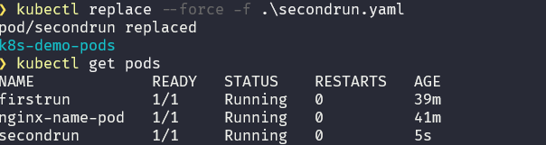
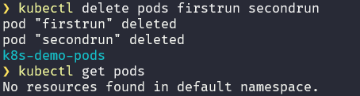

# K8S - exercise 1: create, fix, get, and delete PODS

This exercise is based on the course LinuxFoundationX LFS158x
Introduction to Kubernetes.

## Create a pod in a declarative way

create a file call pod.yaml

touch pod.yaml
vim pod.yaml

past this code in pod.yaml

```yaml
apiVersion: v1
kind: Pod
metadata:
  name: nginx
spec:
  containers:
    - name: nginx
      image: nginx:1.14.2
      ports:
        - containerPort: 80
```

Run the command:

```bash
kubectl create -f pod.yaml
```



## Create a pod in a imperative way

```bash
kubectl run firstrun --image=nginx
```

Get pods to see the new pod:

```bash
kubectl get pods
kubectl get pods -o wide
```



## Create a pod in a mix way (declarative and imperative)

```bash
kubectl run firstrun --image=ngixx --port=88 --dry-run -o yaml > secondrun.yaml
```

If you notice, I introduced some errors in the YAML file so that I can fix them.

Modify because it is not possible to have two pods with the same name and label:

name, label, container -> name

```bash
kubectl describe secondrun
```

Run this command, to replace the previous pod:

```bash
kubectl replace --force -f secondrun.yaml
```



Now let's delete the pods:

```bash
kubectl delete -f pod.yaml
```

```bash
kubectl delete pods firstrun secondrun
```



## Articles and other resources

- https://dev.to/bass/k8s-exercise-1-create-fix-get-and-delete-pods-4be2

- https://kubernetes.io/docs/concepts/workloads/pods/
